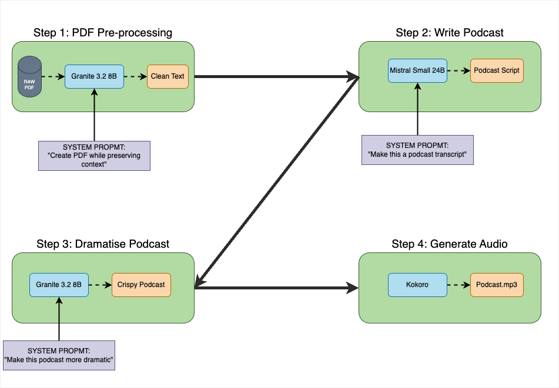

## NotebookOllama: An Open Source version of NotebookLM



[Listen to audio from the example here](./resources/_podcast.mp3)

This is a guided series of tutorials/notebooks that can be taken as a reference or course to build a PDF to Podcast workflow. 

You will also learn from the experiments of using  Text to Speech Models.

It assumes zero knowledge of LLMs, prompting and audio models, everything is covered in their respective notebooks.

### Outline:

Here is step by step thought (pun intended) for the task:

- Step 1: Pre-process PDF: Use `Granite 3.2 8B` to pre-process the PDF and save it in a `.txt` file.
- Step 2: Transcript Writer: Use `Granite 3.2 8B` or `Mistral-Small:24b` model to write a podcast transcript from the text
- Step 3: Dramatic Re-Writer: Use `Granite 3.2 8B` or `Mistral-Small:24b` model to make the transcript more dramatic
- Step 4: Text-To-Speech Workflow: Use `Kokoro` to generate a conversational podcast

Note 1: In Step 1, we prompt the 1B model to not modify the text or summarize it, strictly clean up extra characters or garbage characters that might get picked due to encoding from PDF. Please see the prompt in Notebook 1 for more details.

Note 2: For Step 2, you can also use `Granite 3.2 8B` model, we recommend experimenting and trying if you see any differences. The 70B model was used here because it gave slightly more creative podcast transcripts for the tested examples.

Note 3: For Step 4, please try to extend the approach with other models. These models were chosen based on a sample prompt and worked best, newer models might sound better. Please see [Notes](./TTS_Notes.md) for some of the sample tests.

### Detailed steps on running the notebook:

Requirements: System with 32GB VRAM for using Ollama local LLM models.
For running the 70B model, you will need a GPU with aggregated memory around 140GB to infer in bfloat-16 precision.

Note: For our GPU Poor friends, you can also use the 8B and lower models for the entire pipeline. There is no strong recommendation. The pipeline below is what worked best on first few tests. You should try and see what works best for you!

- Before getting started, please make sure to download the model of your choice via ollama.


- First, please Install the requirements from [here]() by running inside the folder:

```
python3.12 -m venv --upgsource notebooklm-venv/bin/activate   
source notebooklm-venv/bin/activate     
 
git clone https://github.ibm.com/Saeed-Kasmani/NotebookWatsonx
cd llama-recipes/recipes/quickstart/NotebookWatsonx/
pip install -r requirements.txt --use-deprecated=legacy-resolver 
```

- Notebook 1:

This notebook is used for processing the PDF and processing it using the new Feather light model into a `.txt` file.

Update the first cell with a PDF link that you would like to use. Please decide on a PDF to use for Notebook 1, it can be any link but please remember to update the first cell of the notebook with the right link. 

Please try changing the prompts for the `Granite 3.2 8B` model and see if you can improve results.

- Notebook 2:

This notebook will take in the processed output from Notebook 1 and creatively convert it into a podcast transcript using the `QWQ` model. If you are GPU rich, please feel free to test with the QWQ model!

Please try experimenting with the System prompts for the model and see if you can improve the results and try the 8B model as well here to see if there is a huge difference!

- Notebook 3:

This notebook takes the transcript from earlier and prompts `Granite 3.2 8B` to add more dramatization and interruptions in the conversations. 

There is also a key factor here: we return a tuple of conversation which makes our lives easier later. Yes, studying Data Structures 101 was actually useful for once!

For our TTS logic, we use two different models that behave differently with certain prompts. So we prompt the model to add specifics for each speaker accordingly.

Please again try changing the system prompt and see if you can improve the results. We encourage testing the feather light 3B and 1B LLAMA models as well at this stage

- Notebook 4:

Finally, we take the results from last notebook and convert them into a podcast. We use the `Kokoro` model for a conversation.

The speakers and the prompt for kokoro model were decided based on experimentation. Please try experimenting, you can find more details in the resources section.


#### Note: Right now there is one issue: Parler needs transformers 4.43.3 or earlier and for steps 1 to 3 of the pipeline you need latest, so we just switch versions in the last notebook.

### Next-Improvements/Further ideas:

- Speech Model experimentation: The TTS model is the limitation of how natural this will sound. This probably be improved with a better pipeline and with the help of someone more knowledgable-PRs are welcome! :) 
- LLM vs LLM Debate: Another approach of writing the podcast would be having two agents debate the topic of interest and write the podcast outline. Right now we use a single LLM (70B) to write the podcast outline
- Testing QwQ for writing the transcripts
- Better prompting
- Support for ingesting a website, audio file, YouTube links and more. Again, we welcome community PRs!

### Resources for further learning:

- https://betterprogramming.pub/text-to-audio-generation-with-bark-clearly-explained-4ee300a3713a
- https://colab.research.google.com/drive/1dWWkZzvu7L9Bunq9zvD-W02RFUXoW-Pd?usp=sharing
- https://colab.research.google.com/drive/1eJfA2XUa-mXwdMy7DoYKVYHI1iTd9Vkt?usp=sharing#scrollTo=NyYQ--3YksJY
- https://replicate.com/suno-ai/bark?prediction=zh8j6yddxxrge0cjp9asgzd534
- https://suno-ai.notion.site/8b8e8749ed514b0cbf3f699013548683?v=bc67cff786b04b50b3ceb756fd05f68c
- https://medium.com/@faseehahmed2606/how-to-create-professional-ai-voiceovers-for-free-with-kokoro-tts-better-than-elevenlabs-b86f3f801063

